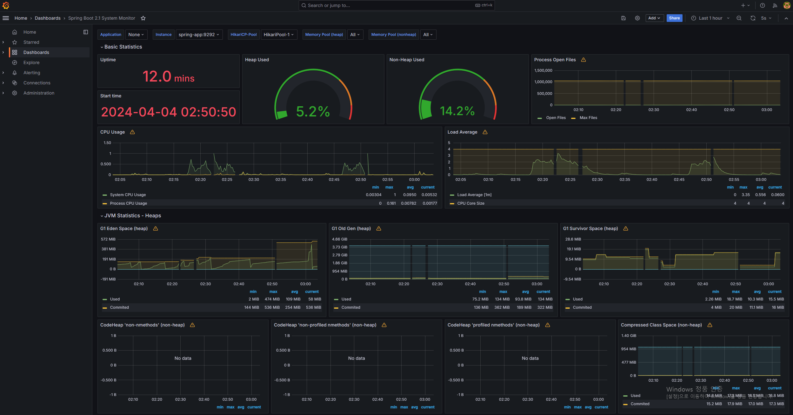
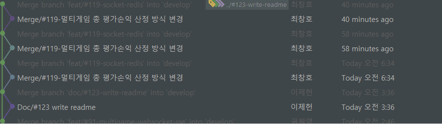
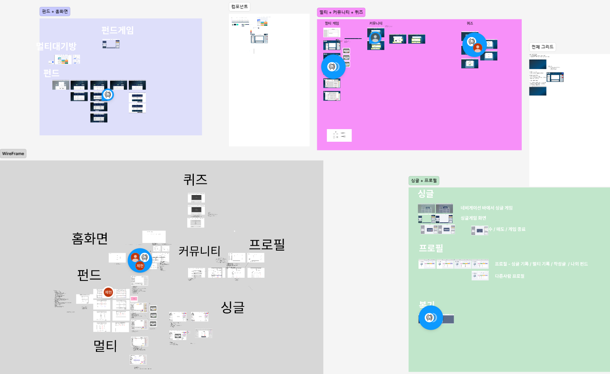

# 📜 목차

1. [서비스 소개](#서비스-소개)
2. [기획 배경](#기획-배경)
3. [화면소개](#-화면-소개)
4. [기술 스택](#-기술-스택)
5. [기술 특이점](#-기술-특이점)
6. [서비스 아키텍처](#-서비스-아키텍처)
7. [프로젝트 산출물](#-프로젝트-산출물)

---

# 🐜 서비스 소개 🐜

:globe_with_meridians:[지금이니 접속하기](https://zayoung21.store)

## ✨서비스 설명 ✨

### ✨개요 ✨

- **차트** 기반 모의 주식 투자 게임
- 서비스 명 : **지금이니?!**

### 🎯 타겟 🎯

- **주식에 관심이 있는 사람**
- **주식을 시작해보고 싶은 사람**
- **기술적 분석을 통한 차트 백테스팅을 연습해 보고 싶은 사람**

[//]: # (## UCC 🎞️)

# ✨기획 배경 ✨

## 배경

- 안전하고 교육적인 방식으로 투자를 경험해볼 수 있는 플랫폼에 대한 수요가 증가
- 모의투자를 통해 투자 원리와 위험관리 등을 학습할 수 있는 기회를 제공
- 차트분석과 투자의 과정을 게임의 형태로 제공함으로써 이용자들이 재미를 느끼면서도 자연스럽게 투자에 대해 학습

## 목적 🥅

**실제 주가 데이터에 기반한 가상 투자 경험을 제공함으로써 초보 투자자들의 시행착오를 줄이고 합리적인 투자 습관을 길러주는 모의투자 서비스를 제공**

---

# 🌹 화면 소개

## 로그인

## 멀티 게임
### 1) 멀티 게임 플레이

### 2) 멀티 게임 세부 내용

## 싱글 게임
### 1) 싱글 게임 플레이

### 2) 싱글 게임 세부 내용

## 싱글 게임 복기  

## 친구 및 알림 

## 커뮤니티

## 퀴즈

## 펀드

# ✨ 기술 스택 ✨

## 1. WebRTC

### WebRTC란?

> WebRTC (Web Real-Time Communication)는 웹 브라우저 간에 플러그인의
> 도움 없이 서로 통신할 수 있도록 설계된 API 입니다. 음성 통화, 영상 통화,
> P2P 파일 공유 등으로 활용될 수 있습니다.

## 2. Web Socket

> Websocket이란 ws 프로토콜을 기반으로 클라이언트와 서버 사이에 지속적인 양방향 연결 스트림을 만들어주는 기술입니다. 이는 stateless한 성질을 가지는 HTTP 일부 통신의 한계를 극복해 주는 것으로 서버는 클라이언트에 데이터를 실시간으로 전달할 수 있게 됩니다.

### 적용

- 멀티게임 서비스 실시간 통신을 통한 채팅 기능
- 멤버의 online/offline 체크를 위해 Redis와 연동하여 사용
- 실시간 알림 기능 - 친구 추가, 게임 초대, 공지사항

## 3. Redis

[//]: # (![]&#40;./assets/skills/redis.png&#41;)

> Redis는 주로 애플리케이션 캐시나 빠른 응답 속도를 가진 데이터베이스로 사용되는 오픈 소스 인메모리 NoSQL 저장소 입니다.

### 적용

- **JWT Token을 사용한 로그인**  
  로그인시 사용되는 Refresh-token을 저장하기 위해서 사용하였으며 보안성을 강화하기 위해서 엑세스 토큰 갱신시에 리프레시 토큰도 같이 갱신되는 `Refresh Token Rotation` 방식을 채용하였습니다.

- **게임 로직 구현**  
  싱글 게임, 멀티 게임, 펀드 게임 진행 상태 저장
  
  멀티 대기방, 멀티 게임방 로직 구현
  - gameRoom:{roomId} 를 key로 멀티 대기/게임 방 관리

- **멤버의 online/offline 상태 관리**
  멤버의 online/offline 상태를 관리하기 위해서 loginStatus를 key로 등록하여 추적했습니다.

## 4. Amazon S3

> AmazonS3는 주로 웹 서비스를 위한 온라인 파일 저장소로 사용되는 클라우드 스토리지 서비스입니다.
>
> S3를 통해 커뮤니티 도메인의 파일을 저장하고 관리합니다.

### 적용

- 커뮤니티 파일 업로드 기능

## 5. Hadoop, Spark

> Hadoop 은 대용량 데이터를 분산 처리하는 데 사용되는 Apache의 오픈소스 프레임워크입니다.

> Apache Spark는 빅데이터 처리를 위한 오픈소스 클러스터 컴퓨팅 프레임워크입니다.

### 적용
- **주식 데이터 분석**  
  주식 데이터를 분석하여 사용자에게 제공하는 서비스를 위해 사용하였습니다.
- **주식 데이터 저장**  
  주식 데이터를 저장하기 위해 사용하였습니다.
  **매매 기록 저장**
  사용자의 매매 기록을 저장하기 위해 사용하였습니다.

## 6. Docker

> Docker는 컨테이너 기반의 오픈소스 가상화 플랫폼입니다.
>
> Docker를 사용하면 개발자는 어플리케이션을 빌드, 배포, 실행할 수 있습니다.
> 
> Docker는 리눅스 컨테이너를 사용하여 어플리케이션을 패키징하고 실행하는데 사용됩니다.
> 
> Docker는 어플리케이션을 더 빠르게 배포할 수 있게 해주고, 어플리케이션을 실행하는 환경을 일관되게 유지할 수 있습니다.

### 적용
- **개발 환경 구축**  
  개발 환경을 구축하기 위해 사용하였습니다.
- **배포 환경 구축** 
  배포 환경을 구축하기 위해 사용하였습니다.

## 7. Jenkins & Nginx

> Jenkins는 오픈소스 자동화 서버입니다.
> 
> Jenkins는 빌드, 테스트, 배포 등의 작업을 자동화할 수 있습니다.  
>
> Nginx는 웹 서버 소프트웨어로, 웹 서버의 기능 외에도 리버스 프록시, 로드 밸런싱, 캐싱, 미디어 스트리밍 등의 기능을 제공합니다.

### 적용
- **CI/CD 파이프라인 구축**  
- **배포 환경 구축**

## 8. Next.js
> Next.js는 React를 기반으로 한 프레임워크로, 서버사이드 렌더링을 지원합니다.
> 
> Next.js는 React의 기능을 확장하여 사용자에게 더 나은 사용자 경험을 제공합니다.

### 적용
- **CSR & SSR**  
  client/server component를 구분하여 server component를 사용할 때는 초기 로드 성능을 높였고 client component를 사용할 때는 React 라이브러리를 활용하여 기능성을 높였습니다.

## 9. React Query
> React Query는 React 애플리케이션에서 데이터를 관리하기 위한 라이브러리입니다.
>
> React Query는 서버에서 데이터를 가져오고 캐싱하며, 데이터를 업데이트하고 무효화하는 기능을 제공합니다.

### 적용
- **서버 데이터 캐싱**  
  서버 데이터를 캐싱하여 서버의 부하를 줄이고 멀티방, 펀드목록 상태를 자동으로 업데이트하였습니다.

## 10. AnyChart 라이브러리
> AnyChart는 데이터 시각화를 위한 라이브러리로, 다양한 차트를 제공합니다.
>
> AnyChart를 사용하면 사용자가 데이터를 쉽게 이해할 수 있도록 시각화할 수 있습니다.

### 적용
- **Candlestick Chart 구현**  
  Candlestick Chart를 활용하여 주식일봉 데이터를 시가,종가,고가,저가,거래량 데이터를 차트로 구현하였습니다.
- **날짜변화에 따른 데이터 갱신**
  날짜변화에 따라 데이터를 갱신하여 실시간 차트처럼 구현하였습니다.

## 11. Zustand
> Zustand는 React 애플리케이션에서 전역 상태를 관리하기 위한 라이브러리입니다.
>
> Zustand를 사용하면 전역 상태를 쉽게 관리할 수 있습니다.

### 적용
- **전역변수 관리**  
  다른 컴포넌트에서 발생한 동작으로 실시간 상태변화를 구현하였습니다.

## 12. React Hook Form
> React Hook Form은 React 애플리케이션에서 폼을 관리하기 위한 라이브러리입니다.
>
> React Hook Form를 사용하면 폼을 쉽게 관리할 수 있습니다.

### 적용
- **기본값 설정**  
  기본값을 설정하여 사용자가 입력하기 전에 미리 설정된 값을 보여주었습니다.
- **입력값 감시**
  입력값을 감시하여 입력값 및 입력길이 설정을 통해 해당 조건을 벗어난 경우, 에러 메시지를 출력하고 submit를 제한하여 올바른 양식의 Form만 저장하였습니다.

## 13. Grafana & Prometheus

> Grafana는 데이터 시각화를 위한 오픈소스 플랫폼입니다.
>
> Prometheus는 시스템 모니터링 및 경고 도구로 사용되는 오픈소스 시스템입니다.

### 적용
- **모니터링 시스템 구축**  
  Grafana와 Prometheus를 사용하여 모니터링 시스템을 구축하였습니다.

## 14. Flask & Schedule
> Flask는 파이썬으로 작성된 마이크로 웹 프레임워크입니다.
>
> Schedule은 파이썬에서 사용할 수 있는 간단한 작업 스케줄러입니다.

### 적용
- **매일 주식 데이터 저장**  
  Flask와 Schedule을 사용하여 매일 주식 데이터를 저장하였습니다.

  
---
# 🐰 기술 특이점
-  싱글 게임 **복기** 및 멀티 게임 **복기**를 통한 해당 게임에서의 나의 매매기록 확인 가능
    - 다른 멤버의 매매기록 확인 및 비교를 통한 **나만의 매매전략** 수립 가능
- **퀴즈**를 통한 주식 관련 정보 습득 및 시드머니 획득을 통한 게임 지속성 향상
- **모니터링 시스템**을 통한 실시간 HTTP 요청 확인, 장애 대응 및 가장 많은 요청(상위 10위 및 누적) 확인 가능
- 여러명과 **실시간**으로 차트 게임 진행 가능
- 차트 특이 기능
  - 마커 기능: 수치가 잘 보이지 않을 때, 마우스를 hover하여 상세 정보를 확인할 수 있음.
  - zoom in/out 기능: 사용자가 확인하고 싶은 기간을 스크롤로 설정하여 확인할 수 있음.
  - 단축키를 사용하여 마우스를 쓰지 않고 주식 매매 가능
- 친구초대 기능: Websocket을 사용하여 알림을 보내고 수락할 경우, 친구와 같은 방에서 멀티플레이 가능
- 매일 주식 데이터 저장
  - Flask & Schedule 사용하여 매일 주식 데이터를 저장

# 🐴 서비스 아키텍처

---

# 🐰 프로젝트 산출물

## 프로젝트 진행

## 1. Git flow

Git flow 사용을 위해 `sourcetree` 프로그램을 사용하였고 `git convention`을 지켜가며 프로젝트 개발에 임하였습니다.

## 프로젝트 산출물

### 1. Figma

### 2. ERD

### 3. API 문서

### 4. Gitlab 이슈 관리를 통한 기능 구현

