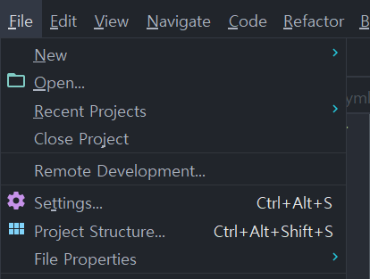
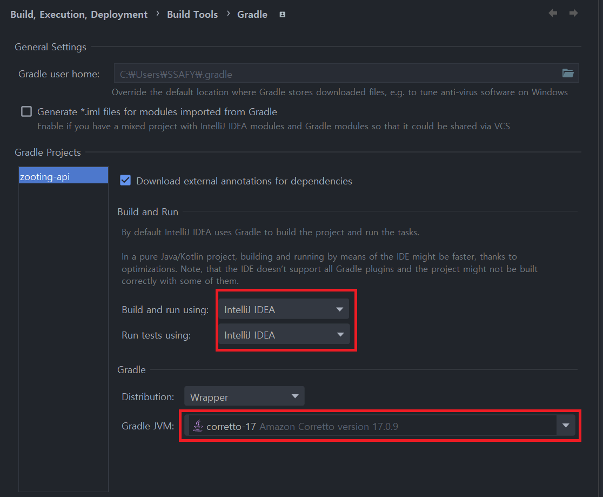
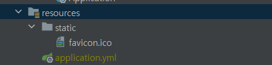

# 포팅 가이드라인

이 문서는 `Zigeum` 서비스 `Front`, `Back`, `Infra`의 빌드 및 배포를 위한 문서입니다.

# 프로젝트 버전 정보

| 공통     | 형상관리          | Gitlab             | -        |
| -------- |---------------|--------------------|----------|
|          | 이슈관리          | Gitlab             | -        |
|          | 커뮤니케이션        | Mattermost, Notion | -        |
| 개발툴   | IDE           | Intellij           | 2023.2.5 |
|          |               | Vscode             | 1.85.1   |
|          |               | Webstorm           | 2023.3.2 |
| Backend  | Java          | Amazon-correto     | 17       |
|          | Spring        | Spring boot        | 3.2.1    |
|          |               | OAuth2             | 6.2.1    |
|          |               | Cloud-AWS          | 2.2.6    |
|          | Build         | Gradle             | 8.5      |
|          | Cloud Storage | AWS S3             | -        |
|          | API Docs      | Swagger3-Springdoc | 2.0.2    |
| Frontend | Next          | Next.js            | 14.1.2   |
|          | React         | React              | 18       |
|          | WebSocket     | Stomp              | 2.3.3    |
|          | API 연동        | Axios              | 1.6.5    |
|          | CSS           | TailwindCSS        | 3.4.1    |
|          | TypeScript    | TypeScript         | 5        |
|          | AnyChart      | AnyChart           | 8.12.0   |
| Database | RDMBS         | MySQL (RDS)        | 8.0.35   |
|          | Redis         | Redis              | 7.2.4    |
|          | Flask         | Flask              | 5.0.5    |
|Big Data  | Hadoop        | Hadoop             | 3.2.1    |
|          | Spark         | Spark              | 3.5.1    |
| Infra    | AWS-EC2       | Ubuntu             | 20.04.6  |
|          | CI/CD         | docker             | 25.0.0   |
|          |               | docker-compose     | 2.21.0   |


---

# Front 배포 설정

- 배포 환경은 `Ubuntu 20.04.6`을 사용합니다.

## HTTPS 인증 (Certbot)

docker nginx를 사용하기 전에 https 인증을 위해서 일단 nginx를 설치하고 https 인증 이후 삭제합니다.

1. Certbot 설치

   ```bash
   $ apt-get update
   $ sudo apt-get install certbot
   $ apt-get install python-certbot-nginx
   ```

2. NGINX SSL 설정

   ```bash
   server {
       listen 80 default_server;
       listen [::]:80 default_server;
       root /var/www/html;
       server_name {{domain_name}} # ex) zayoung21.store;
   }
   ```

3. Nginx 재시작

   ```bash
   $ sudo service nginx restart
   ```

4. SSL 인증서 받기

   ```bash
   sudo certbot --nginx -d {{domain_name}} -d {{sub_domain_name}}
   ```

   인증서 인증시 개인 이메일이 필요합니다.

5. 로컬 Nginx 완전 삭제

   ```bash
   sudo apt-get -y remove --purge nginx nginx-full nginx-common
   ```

   인증 완료 후 docker nginx 사용을 위해서 nginx를 완전히 삭제해 줍니다.

## Docker Nginx 설정

Docker Nginx 설정 파일은 프로젝트 `/etc/nginx/sites-enabled/default.conf` 에 위치해 있습니다.

```bash
server {
  listen 80;
  server_name zayoung21.store;
  return 301 https://$host$request_uri;
}
server {
  listen 443 ssl;
  server_name zayoung21.store;

  ssl_certificate /etc/letsencrypt/live/zayoung21.store/fullchain.pem;
  ssl_certificate_key /etc/letsencrypt/live/zayoung21.store/privkey.pem;

  ssl_protocols TLSv1.2;
  ssl_prefer_server_ciphers on;

  location / {
          proxy_pass http://localhost:8081;
          proxy_set_header Host $http_host;
          proxy_set_header X-Real-IP $remote_addr;
          proxy_set_header X-Forwarded-For $proxy_add_x_forwarded_for;
          proxy_set_header X-Forwarded-Proto $scheme;
        }

  location /api {
          proxy_pass http://localhost:4000;
          proxy_set_header Host $http_host;
          proxy_set_header X-Real-IP $remote_addr;
          proxy_set_header X-Forwarded-For $proxy_add_x_forwarded_for;
          proxy_set_header X-Forwarded-Proto $scheme;
        }
 location /swagger-ui {
          proxy_pass http://localhost:4000;
          proxy_set_header Host $http_host;
          proxy_set_header X-Real-IP $remote_addr;
          proxy_set_header X-Forwarded-For $proxy_add_x_forwarded_for;
          proxy_set_header X-Forwarded-Proto $scheme;
        }
 location /v3 {
          proxy_pass http://localhost:4000;
          proxy_set_header Host $http_host;
          proxy_set_header X-Real-IP $remote_addr;
          proxy_set_header X-Forwarded-For $proxy_add_x_forwarded_for;
          proxy_set_header X-Forwarded-Proto $scheme;

        }
 location ~ ^/(oauth2|login/oauth2) {
          proxy_pass http://localhost:4000;
          proxy_set_header Host $http_host;
          proxy_set_header X-Real-IP $remote_addr;
          proxy_set_header X-Forwarded-For $proxy_add_x_forwarded_for;
          proxy_set_header X-Forwarded-Proto $scheme;
        }
 location /hadoop {
          proxy_pass http://localhost:4000;
          proxy_set_header Host $http_host;
          proxy_set_header X-Real-IP $remote_addr;
          proxy_set_header X-Forwarded-For $proxy_add_x_forwarded_for;
          proxy_set_header X-Forwarded-Proto $scheme;
        }

 location /ws {
          proxy_pass http://localhost:4000;
          proxy_http_version 1.1;
          proxy_set_header    Upgrade             $http_upgrade;
          proxy_set_header    Connection          'upgrade';
          proxy_set_header    Host                $host;
          proxy_cache_bypass                      $http_upgrade;
        }
 location /sse {
        proxy_pass http://localhost:4000;
        chunked_transfer_encoding off;
        proxy_http_version 1.1;
        proxy_set_header Connection '';
        proxy_set_header Host $host;
        proxy_cache_bypass $http_upgrade;
        proxy_buffering off;
        }

}

```

백엔드 docker container 이름, 도메인 이름을 자신의 서버 환경에 맞게 변경해 줍니다.

## Dockerfile 설정

Front 빌드 및 배포를 위한 도커 파일은 프로젝트내 `zigeum/Dockerfile` 에 위치하여 있습니다.

```docker
FROM gradle:8.5-jdk AS build
COPY src ./src
COPY build.gradle settings.gradle  ./

RUN gradle clean build -x test

FROM amazoncorretto:17 AS run
COPY --from=build /home/gradle/build/libs/backend-0.0.1-SNAPSHOT.jar app.jar

EXPOSE 8080


CMD ["java", "-jar", "app.jar"]
```


---

# Backend 빌드 및 배포 설정

## 빌드 설정

프로젝트 빌드를 위한 `intellij` 설정 입니다.



1. SDK 및 language level 설정
   1. `File` → `Project Structure` → `Project`
   2. `SDK`에 `corretto-17`을 설정
   3. `language level`을 `17 - Sealed types`로 설정
2. Gradle 설정

   1. `File` → `Settings` → `Build, Execution, Deployment` → `Build Tools` → `Gradle`
   2. 다음과 같이 설정

      

### resources 폴더 구조



### 서버 yml 파일 설정

`{{ name }}`안의 내용을 사용자 환경에 맞게 수정하시면 됩니다.

파일경로: `zigeum-api/src/main/resources/{{yml-name}}.yml`

- **application.yml (prod 환경)**

  ```yaml
    server:
      port: 8080
    
    spring:
      data:
        jdbc:
          repositories:
            enabled: false
        #Redis
        redis:
          host: redis
          port: 6379
          lettuce:
            pool:
              max-active: 5 # pool에 할당될 수 있는 커넥션 최대수
              max-idle: 5 # pool의 'idle' 커넥션 최대수
              min-idle: 2
          password: zigeumghkdlxld
      # MySQL
      datasource:
        url: jdbc:mysql://{{mysql-address}}mysql:3306/{{db-name}}?serverTimezone=UTC&useUniCode=yes&characterEncoding=UTF-8
        username: { { mysql-username } }
        password: { { mysql-password } }
        driver-class-name: com.mysql.cj.jdbc.Driver
      jpa:
        hibernate:
          ddl-auto: none
        show-sql: false
        properties:
          hibernate:
            dialect: org.hibernate.dialect.MySQLDialect
            format_sql: true
        defer-datasource-initialization: true
        generate-ddl: true
      mvc:
        pathmatch:
          matching-strategy: ant_path_matcher
      #Security
      security:
        oauth2:
          client:
            registration:
              kakao:
                client-id: {{ kakao-develop-restapi-key }}
                client-secret: {{ kakao-develop-restapi-key }}
                redirect-uri: {{ domain-address }}/login/oauth2/code/kakao https://zayoung21.store/login/oauth2/code/kakao
                client-authentication-method: client_secret_post
                authorization-grant-type: authorization_code
                scope: account_email
                client-name: Kakao
            provider:
              kakao:
                authorization_uri: https://kauth.kakao.com/oauth/authorize
                token_uri: https://kauth.kakao.com/oauth/token
                user-info-uri: https://kapi.kakao.com/v2/user/me
                user_name_attribute: id
    #JWT
    jwt:
      secretKey: { { jwt-key } }
      access-token-expiration: 180000 # 50시간 (30분: 1800)
      refresh-token-expiration: 1209600 # 14일
      issuer: { { service-name } } # zigeum
    
    # Social Redirect Url
    client:
      redirect-url:
        success: https://zayoung21.store/login
        anonymous: https://zayoung21.store/login
        fail: https://zayoung21.store/signin
    
    
    logging:
      level:
        root: info
    
    springdoc:
      api-docs:
        path: /api-docs
        groups:
          enabled: true
      swagger-ui:
        path: /swagger-ui.html
        enabled: true
        groups-order: asc
        tags-sorter: alpha
        operations-sorter: alpha
        display-request-duration: true
        doc-expansion: none
      cache:
        disabled: true
      override-with-generic-response: false
      model-and-view-allowed: false
      default-consumes-media-type: application/json
      default-produces-media-type: application/json
      group-configs:
        - group: all-api
          paths-to-match:
            - /**
          paths-to-exclude:
            - /favicon.ico
            - /health
        - group: jwt-api
          paths-to-match:
            - /api/**
      show-actuator: true
    
    #actuator 기능을 웹에 노출
    management:
      server:
        port: 9292
      #java, os, env 정보 확인
      info:
        java:
          enabled: true
        os:
          enabled: true
        env:
          enabled: true
        git:
          mode: "full"
      endpoints:
        web:
          base-path: "/management"
          exposure:
            include: "*"
            exclude: "env,beans"
      endpoint:
        health:
          show-components: always
    
    info:
      app:
        name: zigeum-app
        company: ssafy
    
    #s3
    cloud:
      aws:
        s3:
          bucket: { { aws-s3-bucket-name } }
        region:
          static: { { aws-s3-region } }
        stack:
          auto: false
        credentials:
          access-key: { { aws-s3-access-key } }
          secret-key: { { aws-s3-secret-key } }  
  ```

  키 발급 방법

  1. AWS에 가입
  2. IAM 사용자로 S3FullAccess 권한을 부여한 사용자를 생성
  3. 해당 사용자의 계정으로 접속하여 키 발급

### Dockerfile 설정

Back 빌드 및 배포를 위한 도커 파일은 프로젝트내 `zigeum-api/Dockerfile` 에 위치하여 있습니다.

```docker
FROM amazoncorretto:17

# 인자 설정 - JAR_File
ARG JAR_FILE=build/libs/zigeum-api-0.0.1-SNAPSHOT.jar

# 인자 설정 부분과 jar 파일 복제 부분 합쳐서 진행해도 무방
COPY ${JAR_FILE} zigeum-api.jar

# 실행 명령어
ENTRYPOINT ["java","-Djava.security.egd=file:/dev/./urandom","-jar","/zigeum-api.jar", "--spring.profiles.active=prod"]
```


---

# Server 설정

## docker 설치

1. 우분투 시스템 패키지 업데이트

   ```bash
   $ sudo apt-get update
   ```

2. 도커 설치에 필요한 패키지 설치

   ```bash
   $ sudo apt-get install apt-transport-https ca-certificates curl gnupg-agent software-properties-common
   ```

3. Docker 공식 GPG 설치

   ```bash
   $ curl -fsSL <https://download.docker.com/linux/ubuntu/gpg> | sudo apt-key add -
   ```

4. Docker의 공식 apt 저장소를 추가

   ```bash
   $ sudo add-apt-repository "deb [arch=amd64] <https://download.docker.com/linux/ubuntu> $(lsb_release -cs) stable"
   ```

5. 시스템 패키지 업데이트

   ```bash
   $ sudo apt-get update
   ```

6. Docker 설치

   ```bash
   $ sudo apt-get install docker-ce docker-ce-cli containerd.io
   ```

7. Docker 설치 확인

   ```bash
   $ sudo systemctl status docker
   $ docker -v
   ```

## docker-compose 설치

1. Docker-compose 설치

   ```bash
   $ sudo curl -SL "<https://github.com/docker/compose/releases/download/v2.23.0/docker-compose-$>(uname -s)-$(uname -m)" -o /usr/local/bin/docker-compose
   ```

   - docker-compose yml 3.0 이상을 사용할 경우 2.0.0 이상의 docker-compose를 설치해야 한다.

2. Docker-compose 권한 부여

   ```bash
   $ sudo chmod +x /usr/local/bin/docker-compose
   ```

3. Docker-compose 심볼릭 링크 지정

   ```bash
   $ sudo ln -s /usr/local/bin/docker-compose /usr/bin/docker-compose
   ```

4. docker-compose 버전 확인

   ```bash
   $ docker-compose --version
   ```

---

## docker-compose.yml 작성

프로젝트 가장 상위에 `docker-compose.yml` 파일을 생성합니다.

```yaml
version: '3'
services:
  mysql:
    image: mysql:latest
    container_name: mysql
    environment:
      MYSQL_ROOT_PASSWORD: ${MYSQL_ROOT_PASSWORD}
      MYSQL_DATABASE: ${MYSQL_DB}
      MYSQL_CHARSET: utf8mb4
      MYSQL_COLLATION: utf8mb4_unicode_ci
    ports:
      - "3306:3306"
    command:
      - --character-set-server=utf8mb4
      - --collation-server=utf8mb4_unicode_ci
    volumes:
      - mysql_data:/var/lib/mysql

  redis:
    image: redis:latest
    container_name: redis
    hostname: redis
    ports:
      - "6379:6379"
    command: redis-server --save 60 1000 --loglevel notice --requirepass ${REDIS_PASSWORD}
    volumes:
      - redis_data:/data

  spring-app:
    container_name: spring-app
    ports:
      - "4000:8080"
    depends_on:
      - mysql
      - redis
    environment:
      MYSQL_HOST : mysql
      MYSQL_USER : root
      MYSQL_PASSWORD : ${MYSQL_ROOT_PASSWORD}
      MYSQL_DATABASE: ${MYSQL_DB}
    image: jayoung977/backend
    env_file:
      - .env

  react-app:
    container_name: react-app
    ports:
      - "8081:80"
    volumes:
      - /etc/letsencrypt:/etc/letsencrypt
      - /usr/share/nginx/statics:/usr/share/nginx/statics
    image: jayoung977/frontend
    env_file:
      - .env


volumes:
  redis_data:
    driver: local
  mysql_data:
    driver: local
```
# docker-hadoop 설정
## docker-build.sh
```shell
#!/bin/bash

docker-compose -f ../docker-compose.hadoop.yml down

docker build -t language-base ./language-base
docker build -t hadoop-base ./hadoopbase
docker build -t hadoop-spark-base ./hadoopsparkbase

docker build -t hadoop-namenode ./namenode
docker build -t hadoop-datanode ./datanode
docker build -t resourcemanager ./resourcemanager
docker build -t yarn-timelineserver ./yarntimelineserver
docker build -t spark-historyserver ./sparkhistoryserver
docker build -t zeppelin ./zeppelin

docker-compose -f ../docker-compose.hadoop.yml up -d
```
## docker-compose.hadoop.yml
```yaml
version: "3.7"

x-datanode_base: &datanode_base
  image: hadoop-datanode


services:
  namenode:
    image: hadoop-namenode
    container_name: namenode
    hostname: namenode
    ports:
      - "50070:9870" # namenode web UI
    volumes:
      - namenode:/opt/hadoop/dfs/name # namenode data mount
      - namenode:/opt/spark/eventLog # spark history log data mount 
      - namenode:/opt/hadoop/yarn/timeline # yarn timeline data mount


  datanode01:
    <<: *datanode_base
    container_name: datanode01
    hostname: datanode01
    depends_on:
      - namenode
    volumes:
      - datanode01:/opt/hadoop/dfs/data
      - datanode01:/opt/hadoop/yarn/data
      - namenode:/opt/spark/eventLog

  datanode02:
    <<: *datanode_base
    container_name: datanode02
    hostname: datanode02
    depends_on:
      - namenode
    volumes:
      - datanode02:/opt/hadoop/dfs/data
      - datanode02:/opt/hadoop/yarn/data
      - namenode:/opt/spark/eventLog

  datanode03:
    <<: *datanode_base
    container_name: datanode03
    hostname: datanode03
    depends_on:
      - namenode
    volumes:
      - datanode03:/opt/hadoop/dfs/data
      - datanode03:/opt/hadoop/yarn/data
      - namenode:/opt/spark/eventLog


  resourcemanager:
    image: resourcemanager
    container_name: resourcemanager
    hostname: resourcemanager
    ports:
      - "8088:8088"


  yarntimelineserver:
    image: yarn-timelineserver
    container_name: yarntimelineserver
    hostname: yarntimelineserver
    ports:
      - "8188:8188"
    volumes:
      - namenode:/opt/hadoop/yarn/timeline

  sparkhistoryserver:
    image: spark-historyserver
    container_name: sparkhistoryserver
    hostname: sparkhistoryserver
    ports:
      - "18080:18080"
    depends_on:
      - namenode
      - resourcemanager
    volumes:
      - namenode:/opt/spark/eventLog

  zeppelin:
    image: zeppelin
    container_name: zeppelin
    hostname: zeppelin
    ports:
      - "9097:8080"
    volumes:
      - namenode:/opt/spark/eventLog
      - /env/hadoop-eco/hadoop/zeppelin/notebook:/zeppelin-0.10.1-bin-all/notebook
      - /home/ec2-user/testdata:/testdata


volumes:
  namenode:
  datanode01:
  datanode02:
  datanode03:


```
## docker-compose.monitor.yml
```yaml
version: '3'
services:
  prometheus:
    image: prom/prometheus:latest
    container_name: prometheus
    user: root
    volumes:
      - /home/monitor/prometheus/:/etc/prometheus/
      - /home/monitor/prometheus/data:/prometheus
    ports:
      - 9090:9090
    restart: always

  grafana:
    image: grafana/grafana:latest
    container_name: grafana
    environment:
      - GF_SECURITY_ADMIN_USER=admin
      - GF_SECURITY_ADMIN_PASSWORD=${GRAFANA_PASSWORD}
      - GF_USERS_ALLOW_SIGN_UP=false
    volumes:
      - /home/monitor/grafana:/var/lib/grafana
      - /home/monitor/grafana/provisioning:/etc/grafana/provisioning
    ports:
      - 3000:3000
    restart: always
    user: root

```
## docker-compose.flask.yml
```yaml
version: '3'

services:
  flask-app:
    container_name: flask-app
    image: flask-app
    ports:
      - "6000:8080"
```
## docker-compose.hadoopapp.yml
```yaml
version: '3'

services:
hadoop-app:
container_name: hadoop-app
image: hadoop-app
ports:
- "5000:8080"
```
---


# 프로젝트 외부 서비스

서비스 이용을 위해서는 소셜로그인이 필요합니다.

현재 카카오 회원가입/로그인의 기능을 제공하고 있습니다.

따라서, 개발자는 `kakao developer` 에서 `API KEY` 발급이 필요합니다.

---

# 시연 시나리오
[시연 시나리오](10기_특화PJT_A207_시연시나리오.pdf)